 
## 查看主页获取源码

> **作者介绍**： **✌**全网粉丝10W+本平台特邀作者、博客专家、CSDN新星计划导师、java领域优质创作者,博客之星、掘金/华为云/阿里云/InfoQ等平台优质作者、专注于项目实战 **✌**

  

### 一、作品包含

源码+数据库+设计文档万字+PPT+全套环境和工具资源+部署教程

### 二、项目技术

前端技术：Html、Css、Js、Vue、Element-ui

数据库：MySQL

后端技术：Java、Spring Boot、MyBatis

  

### 三、运行环境

开发工具：IDEA/eclipse + 微信开发者工具

数据库：MySQL5.7

数据库管理工具：Navicat10以上版本

环境配置软件： JDK1.8+Maven3.6.3

前端Nodejs：14

### 四、项目介绍
项目编号：mpweixinA020

"宠物医院"微信小程序，是一款专为宠物主人设计的便捷服务平台。它以宠物健康为核心，旨在为宠物主人提供专业、便捷的宠物医疗服务。通过这款小程序，宠物主人可以随时随地预约宠物医生，了解宠物健康状况，旨在让宠物主人能够更好地照顾爱宠的健康，同时也提高了宠物医院的运营效率和服务质量。

前台用户功能：浏览首页、宠物用品、服务信息、购物车、服务预约、挂号信息、就诊记录、宠物资料、住院资料、我的收藏管理、用户充值、反馈中心、购物车、我的订单。

后台分为管理员和医生
管理员的功能：系统首页、个人中心、科室管理、用户管理、医生管理、坐诊信息管理、宠物用品管理、服务信息管理、服务预约管理、挂号信息管理、就诊记录管理、宠物资料管理、住院资料管理、系统管理和订单管理。
医生的功能：系统首页、个人中心、坐诊信息管理、挂号信息管理、就诊记录管理、宠物资料管理、住院资料管理。

### 五、运行截图

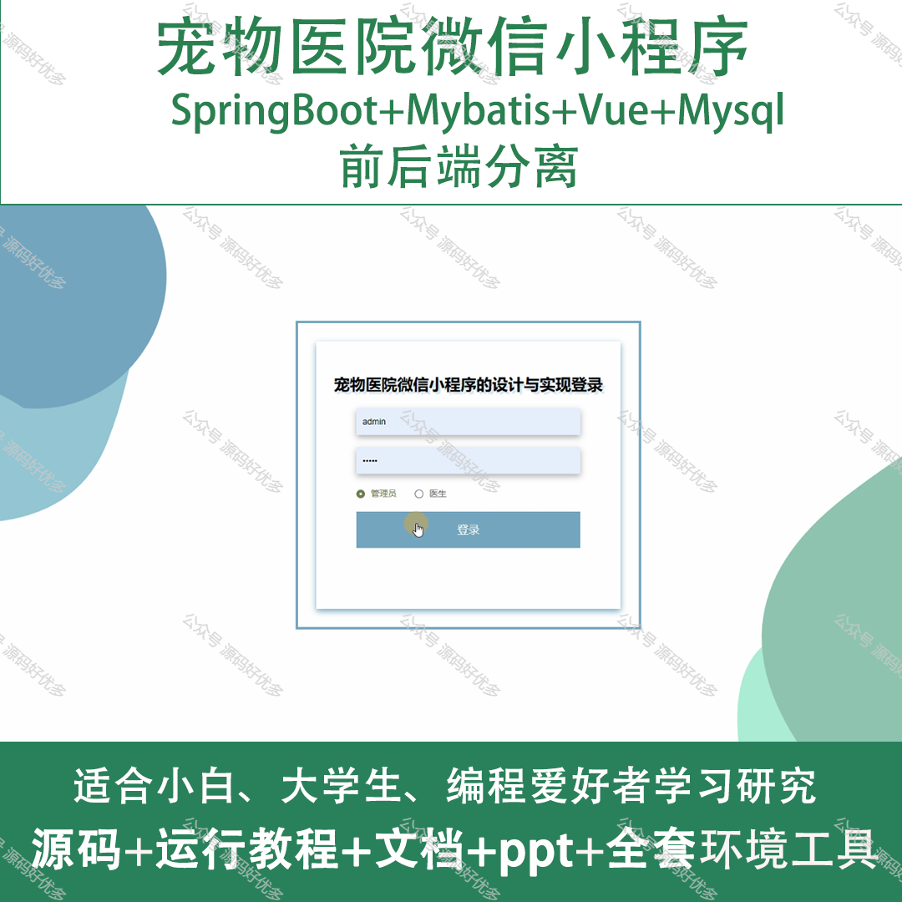
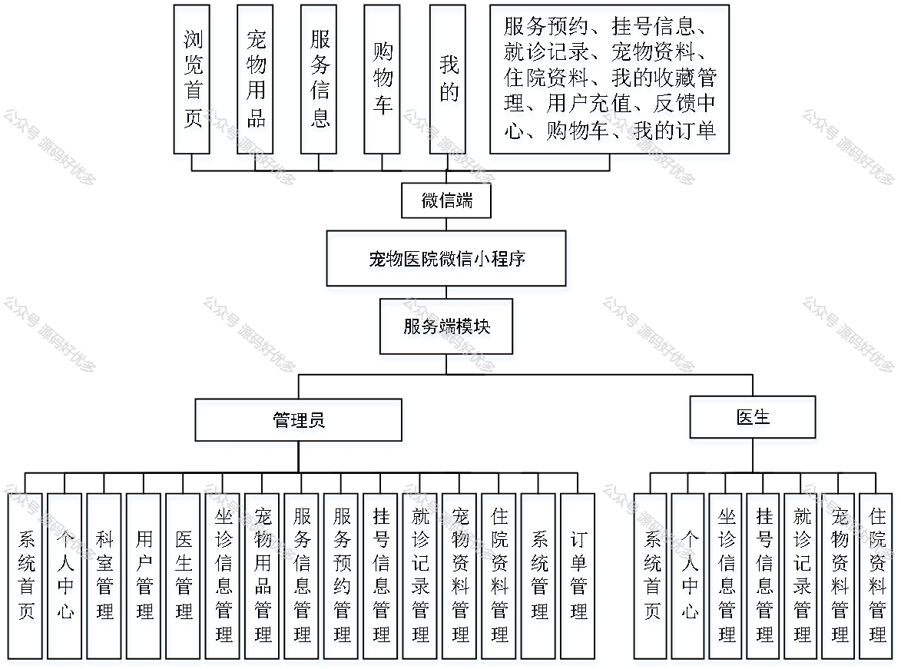
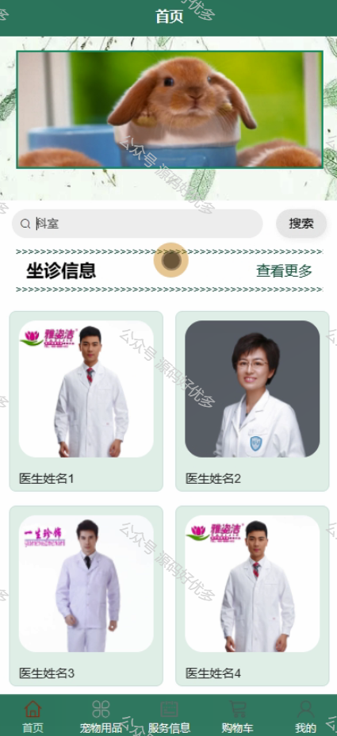
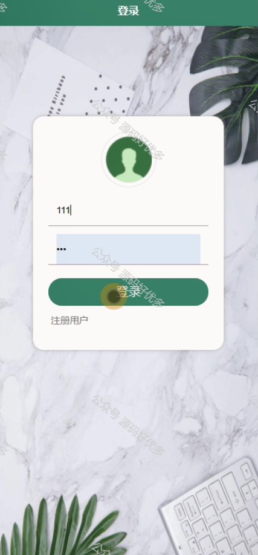
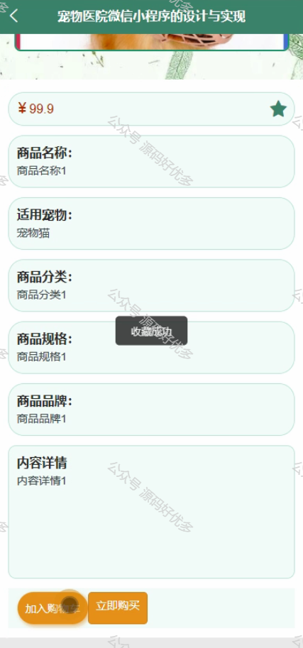
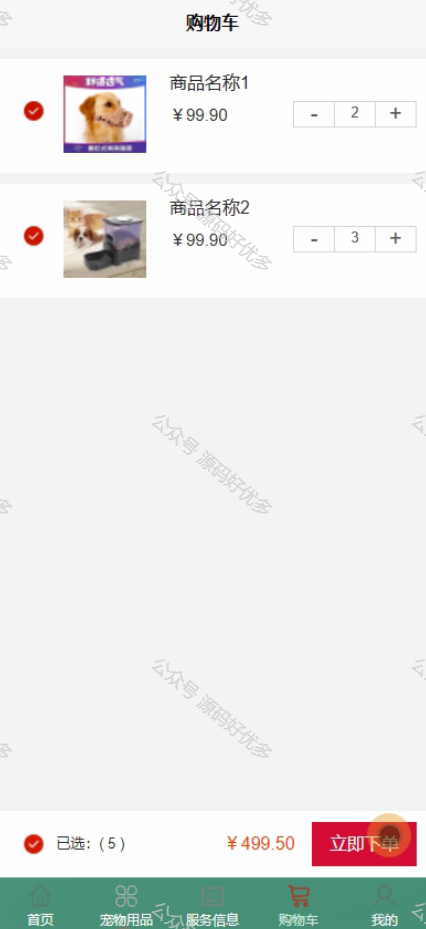
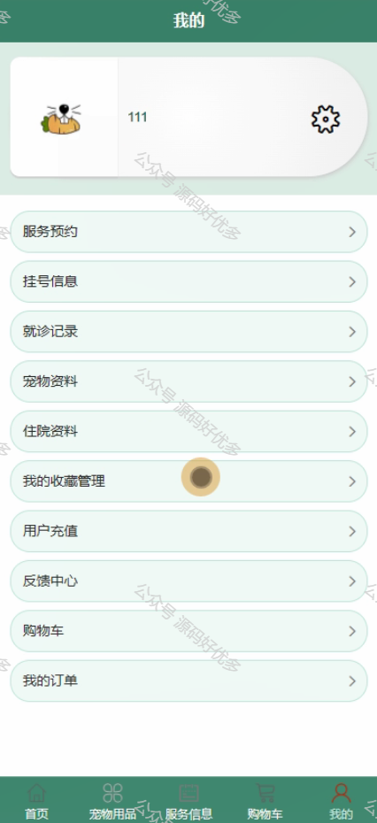
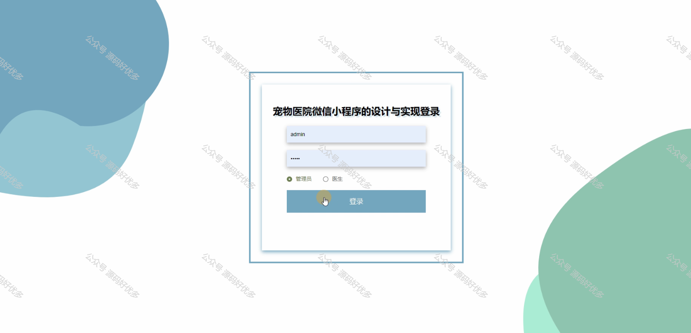
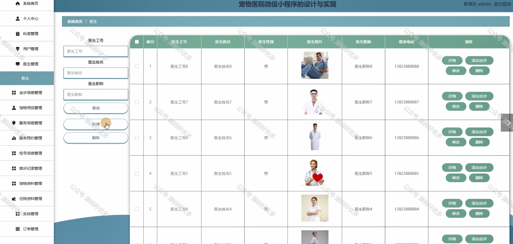
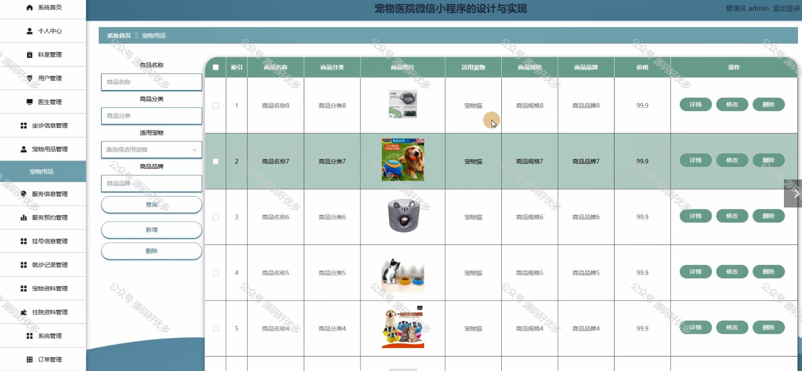
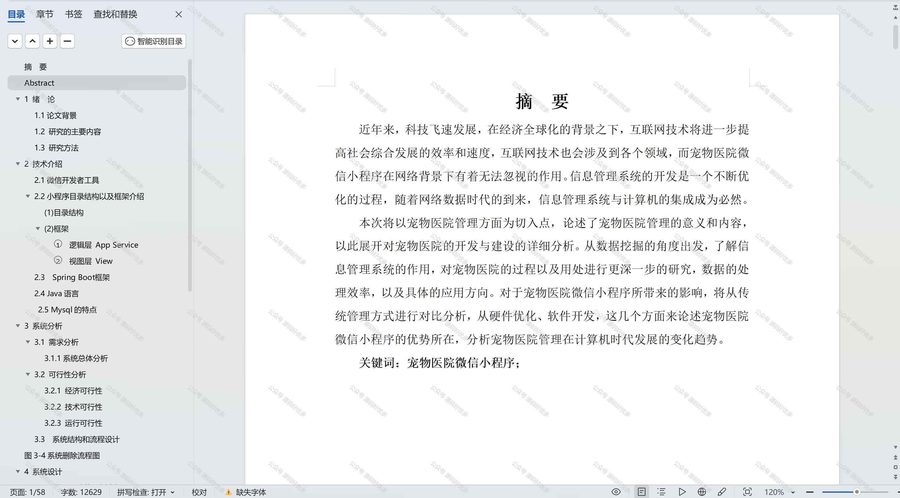

  
